# Architecture & Flow Diagrams

This document contains sequence diagrams for the main user and admin operations in the RC Track Rental application.

## Table of Contents

- [User Operations](#user-operations)
  - [User Registration](#user-registration)
  - [Booking a Track](#booking-a-track)
  - [Modifying a Booking](#modifying-a-booking)
  - [Cancelling a Booking](#cancelling-a-booking)
- [Admin Operations](#admin-operations)
  - [Admin Booking Management](#admin-booking-management)
  - [Processing a Refund](#processing-a-refund)
  - [Managing Tracks & Cars](#managing-tracks--cars)

---

## User Operations

### User Registration

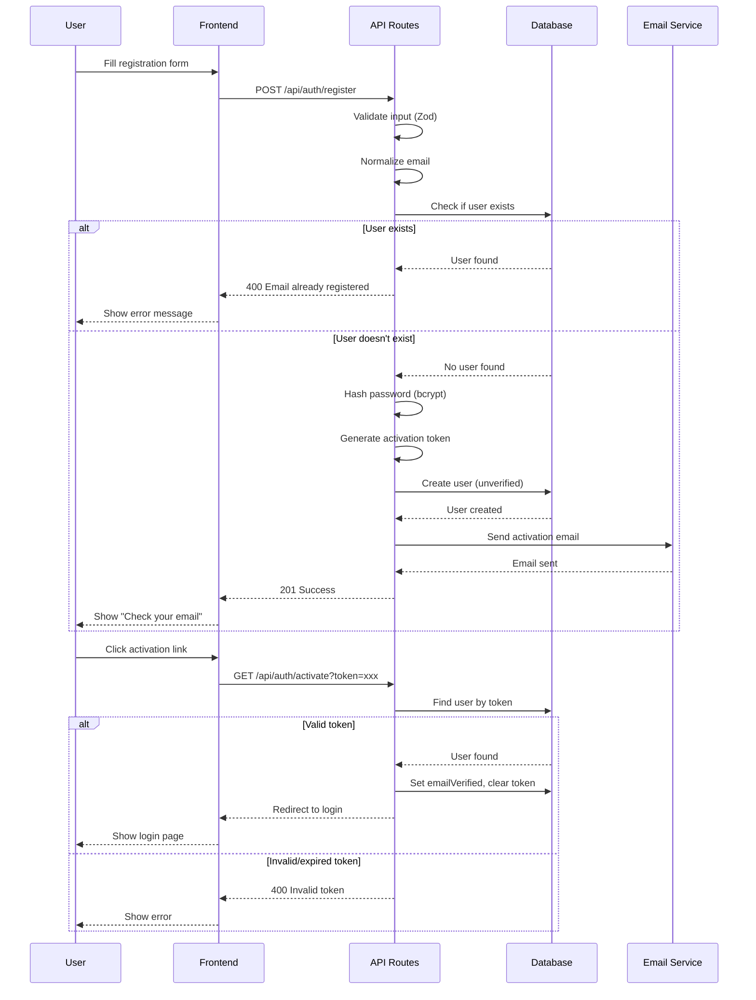

### Booking a Track

This is the main user journey - from selecting a track to completing payment.

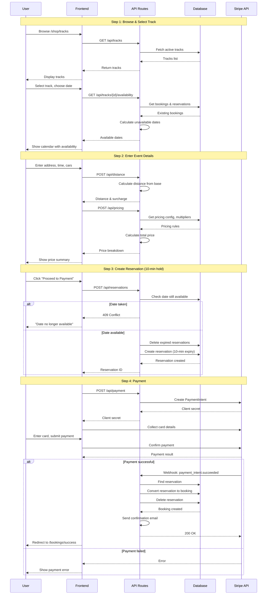

### Modifying a Booking

Users can modify their booking date, time, or car selection.

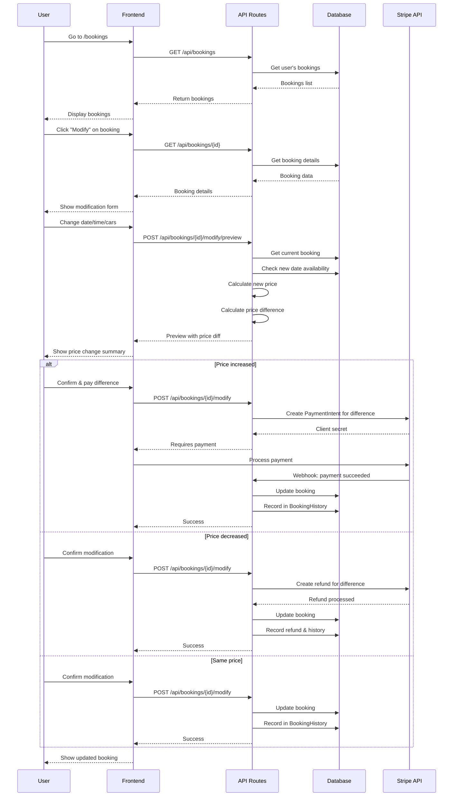

### Cancelling a Booking

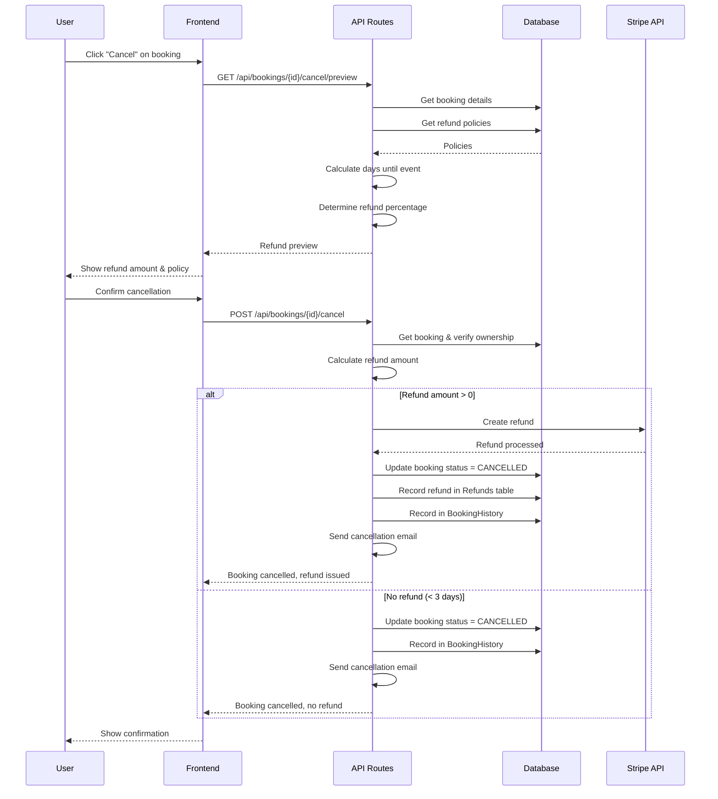

---

## Admin Operations

### Admin Booking Management

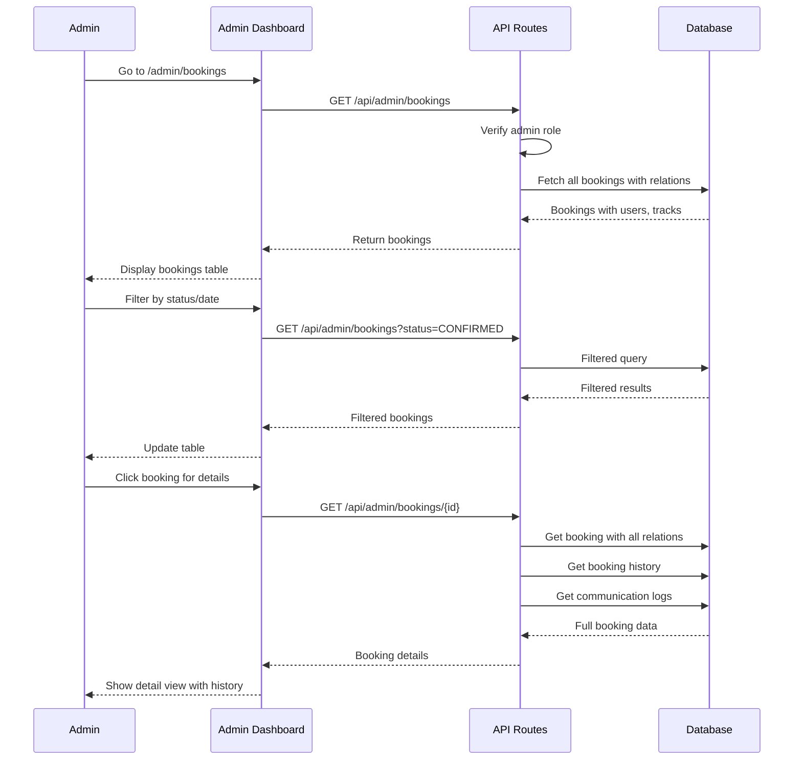

### Processing a Refund

Admins can issue full or partial refunds with custom amounts.

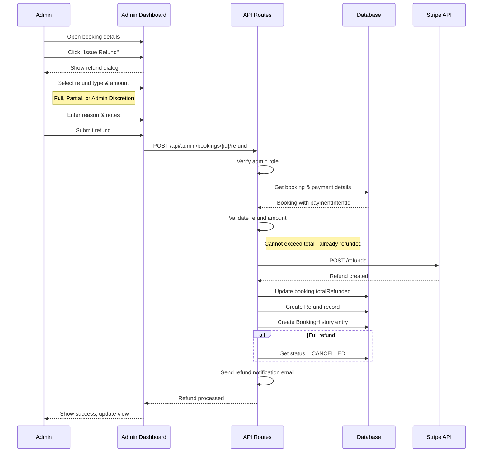

### Managing Tracks & Cars

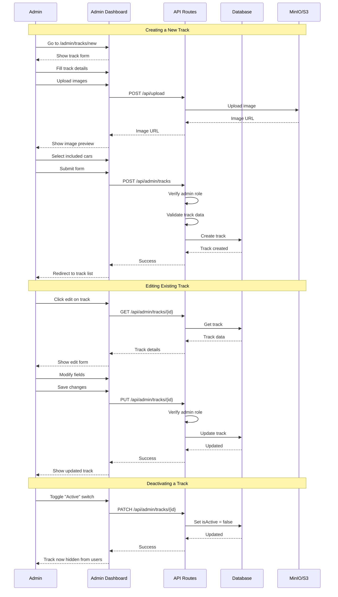

---

## Payment Flow Details

### Stripe Webhook Processing

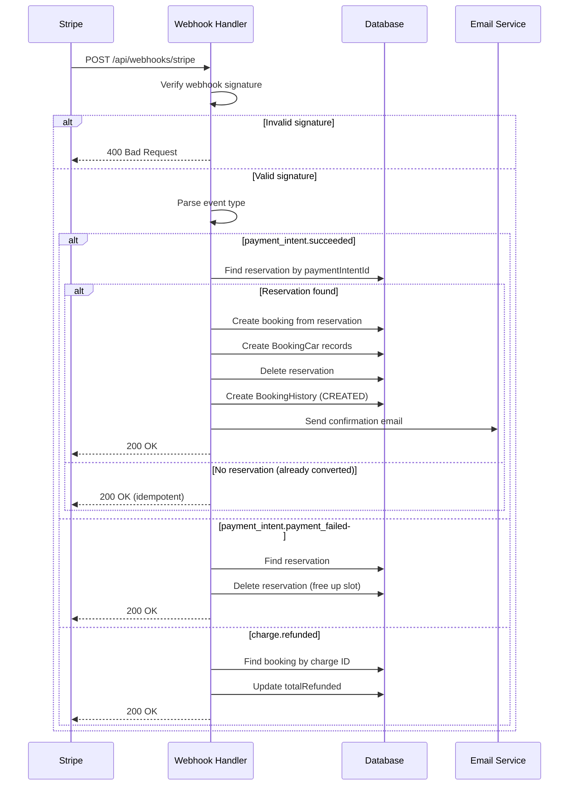

---

## Cron Job Flows

### Reservation Cleanup

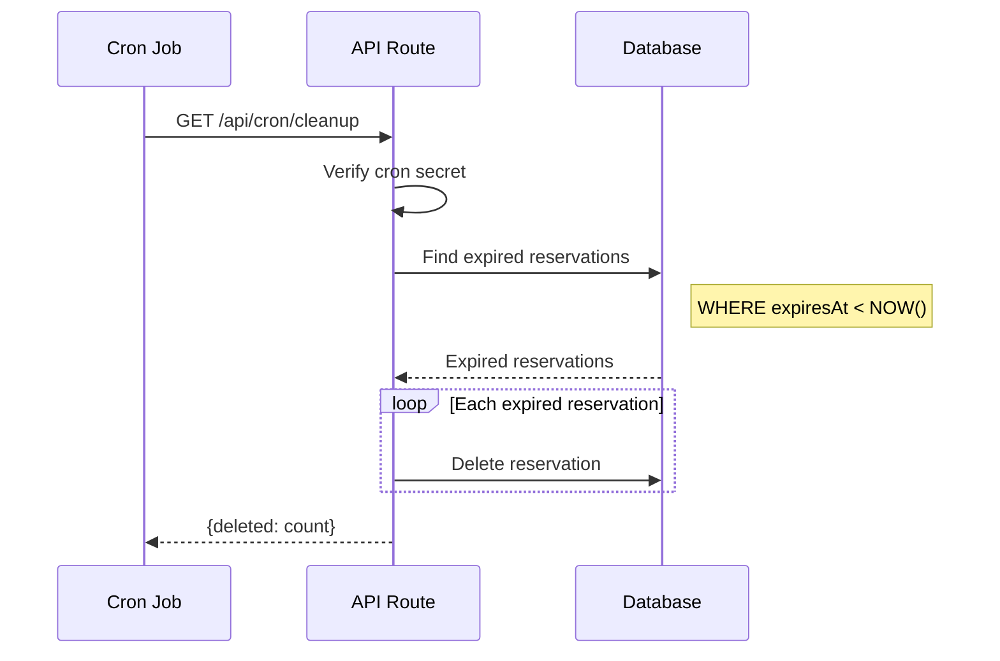

### Booking Reminders

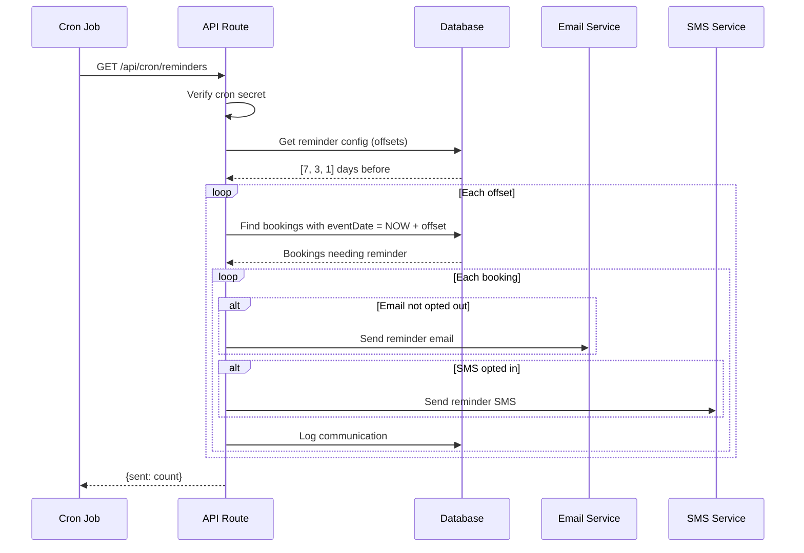

---

## Data Models

### Key Relationships

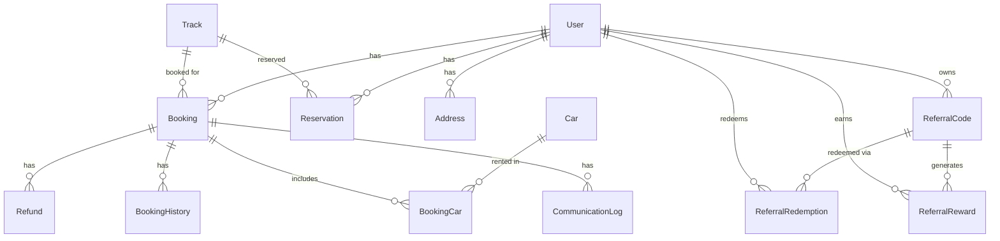

### Track-Car Relationship

The relationship between Tracks and Cars is **not a direct foreign key relationship**. Instead:

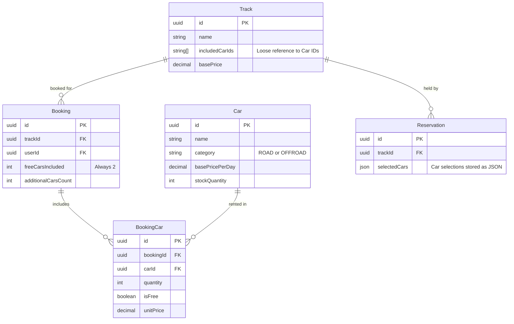

**How it works:**

1. **Track.includedCarIds** (`String[]`) - Stores IDs of 2 cars that come "free" with the track rental. This is a loose reference (no FK constraint) allowing flexibility.

2. **Category matching** - Tracks and Cars both have a `category` field (ROAD or OFFROAD). The UI typically filters cars to show only those matching the track's category.

3. **Reservation.selectedCars** (`Json`) - During checkout, car selections are stored as JSON in the reservation. This captures the user's choices before payment.

4. **BookingCar** (junction table) - When payment succeeds, the reservation converts to a booking, and `BookingCar` records are created with proper foreign keys to both `Booking` and `Car`.

### Default Cars Implementation Flow

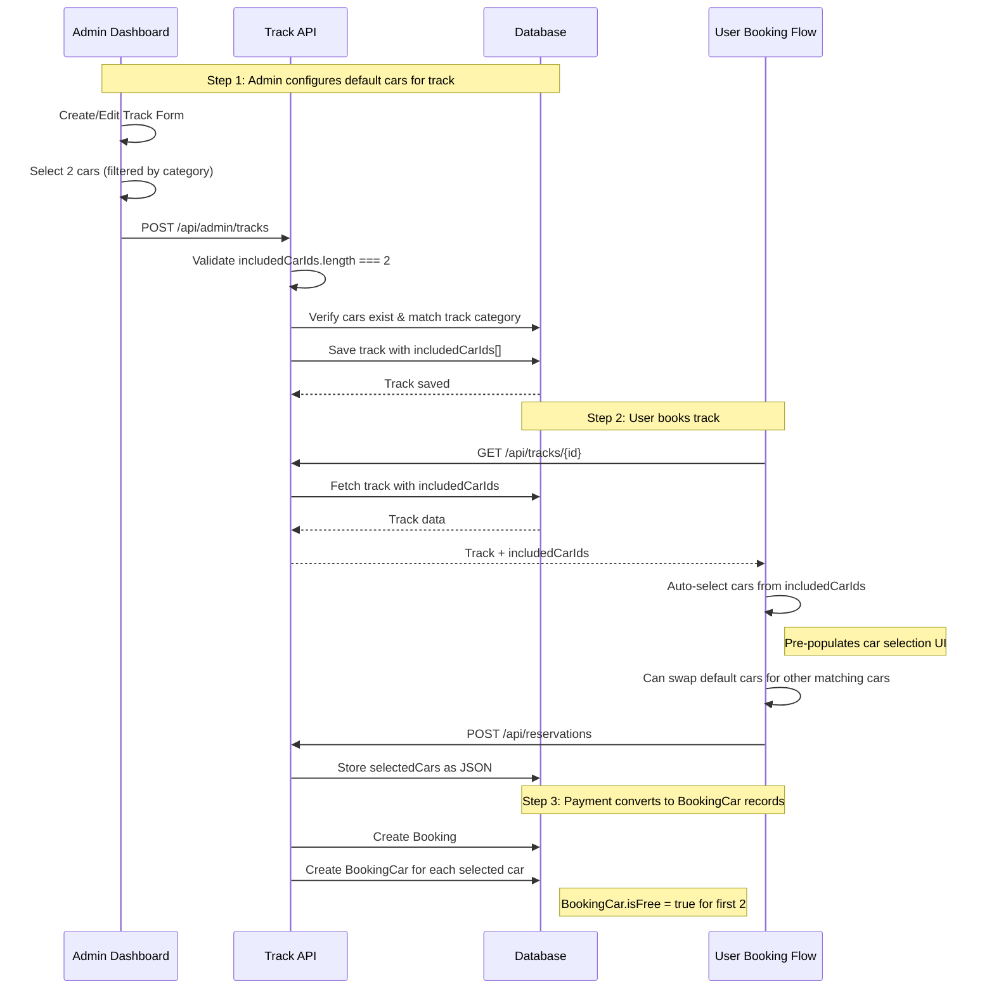

### Admin Track Creation Code

When an admin creates a track, the API validates that:

```typescript
// From app/api/admin/tracks/route.ts
const trackSchema = z.object({
  // ...
  includedCarIds: z.array(z.string().uuid()).length(2, "Must select exactly 2 cars"),
  // ...
})

// Validation: cars must match track category
const cars = await prisma.car.findMany({
  where: { id: { in: validatedData.includedCarIds } }
})

const mismatchedCars = cars.filter(
  (car) => car.category !== validatedData.category
)
if (mismatchedCars.length > 0) {
  return error("Selected cars must match the track category")
}
```

### User Booking Auto-Selection

When a user starts booking, the default cars are pre-selected:

```typescript
// From app/book/page.tsx
if (trackData.track.includedCarIds?.length > 0) {
  // Use the track's specified default cars
  trackData.track.includedCarIds.forEach((carId) => {
    if (matchingCars.some((car) => car.id === carId)) {
      defaultSelectedCars.push({ carId, quantity: 1 })
    }
  })
} else {
  // Fallback: use first 2 matching cars
  matchingCars.slice(0, 2).forEach((car) => {
    defaultSelectedCars.push({ carId: car.id, quantity: 1 })
  })
}
```

**Why this design?**

- **Flexibility**: Tracks can reference any cars without strict coupling
- **Category enforcement**: API validates cars match track category at save time
- **User experience**: Default cars auto-populate the booking form
- **Inventory tracking**: `Car.stockQuantity` allows multiple cars of the same type
- **Pricing clarity**: `BookingCar.isFree` distinguishes included cars from paid extras
- **Fallback behavior**: If `includedCarIds` is empty, system picks first 2 matching cars

---

## See Also

- [README.md](README.md) - Main project documentation
- [e2e/README.md](e2e/README.md) - End-to-end testing guide
- [prisma/schema.prisma](prisma/schema.prisma) - Database schema
